# Architecture & États — ecommerce-api

> Complément au guide d'intégration existant. Ce document couvre les machines à états de chaque module, leurs interactions via l'event bus, les jobs automatiques, et les diagrammes correspondants.

---

## 1. Vue d'ensemble des modules et de leurs états

| Module       | Entité               | Champ d'état               | Piloté par                                                                                  |
| ------------ | -------------------- | -------------------------- | ------------------------------------------------------------------------------------------- |
| Orders       | `Order`              | `OrderStatus`              | Machine à états stricte (`order.state-machine.ts`)                                          |
| Payments     | `Payment`            | `PaymentStatus`            | Machine à états stricte, transitions manuelles restreintes à `REFUNDED`                     |
| Returns      | `ReturnRequest`      | `ReturnStatus`             | Machine à états stricte                                                                     |
| Pickup       | `PickupRequest`      | `PickupStatus`             | Machine permissive (contrôle admin total)                                                   |
| Shipments    | `Shipment`           | `ShipmentStatus`           | Contrôle manuel + règles ad hoc (pas de state-machine dédiée)                               |
| Products     | `Product`            | `ProductStatus`            | Transition contrôlée par validation (attributs requis)                                      |
| Combinations | `ProductCombination` | `isActive` (booléen)       | Généré/désactivé par `combination.service.ts`                                               |
| Promotions   | `Promotion`          | `PromotionStatus`          | **Calculé dynamiquement** à la lecture (`computeDisplayStatus`), jamais lu tel quel en base |
| Coupons      | `CouponCode`         | `isActive` + dates/plafond | **Calculé dynamiquement** (`effectiveIsActive`)                                             |

---

## 2. Machines à états

### 2.1 Commande (`Order`)

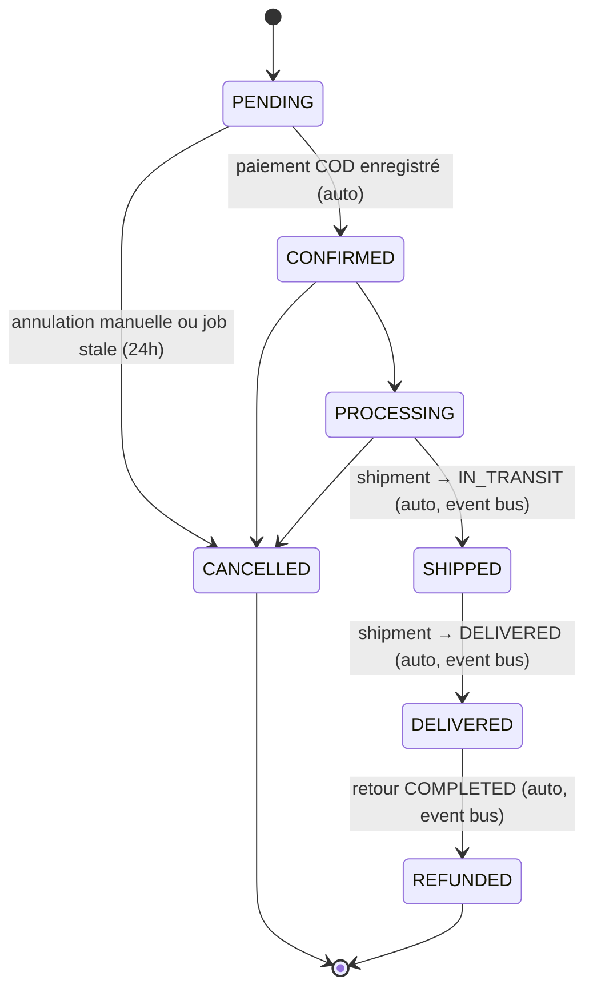

Règles clés :

- Toute transition non listée est rejetée (400) par `assertValidTransition`.
- `PENDING → CANCELLED` peut être déclenché automatiquement par le job `order-expiration.job.ts` (délai configurable via `orders.stale_pending_hours`).
- `DELIVERED` déclenche l'attribution des points de fidélité (`loyaltyService.earnFromOrder`).
- Toute transition émet `order.status.changed` sur l'event bus.

### 2.2 Paiement (`Payment`)

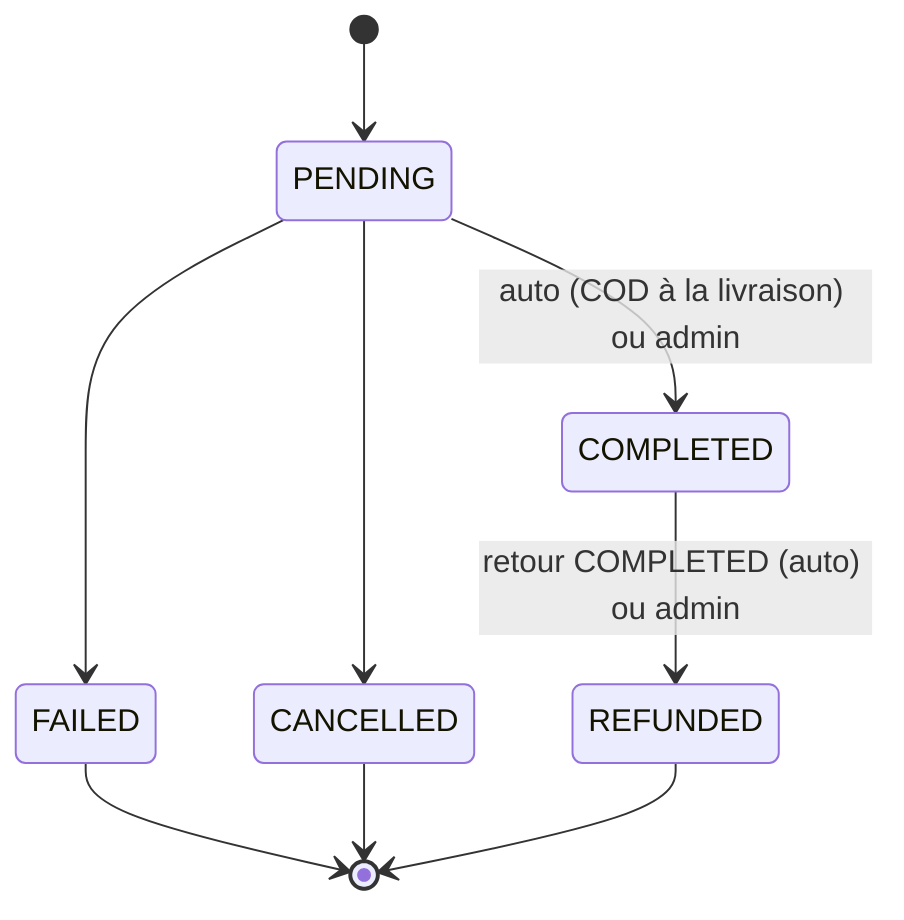

Règles clés :

- Les transitions manuelles admin sont **restreintes à `REFUNDED`** (`payment.service.ts::updateStatus` rejette tout autre statut si `actorRole === "ADMIN"`).
- `COMPLETED` (quelle que soit l'origine) synchronise `Order.status` vers `CONFIRMED` si la commande était `PENDING`.
- `REFUNDED` synchronise `Order.status` vers `REFUNDED`.

### 2.3 Retour (`ReturnRequest`)

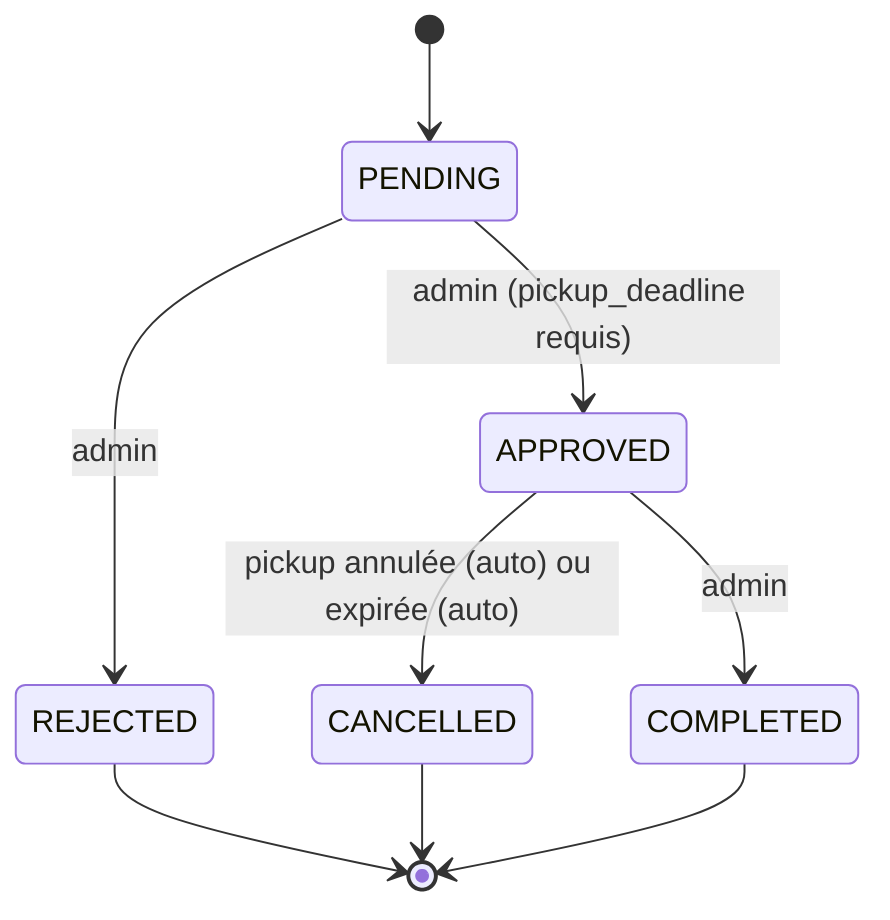

Règles clés :

- `APPROVED` matérialise automatiquement une `PickupRequest` (méthode de collecte choisie à la création du retour).
- `COMPLETED` déclenche en cascade (via `return.status.changed`) : remboursement des paiements complétés, réintégration du stock, reversal des points de fidélité, et passage de `Order.status → REFUNDED`.
- Une commande ne peut avoir qu'un retour `PENDING`/`APPROVED` actif à la fois.

### 2.4 Retrait (`PickupRequest`)

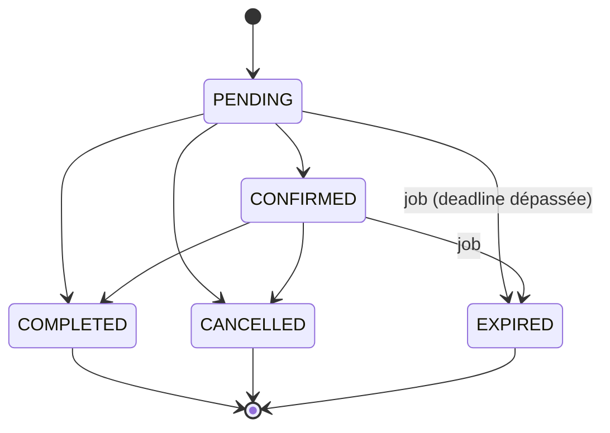

Règles clés :

- Machine volontairement permissive (`PENDING → COMPLETED` direct autorisé) : contrôle admin total, pas de client à protéger.
- `CANCELLED` (manuel) annule en cascade le `ReturnRequest` lié.
- `EXPIRED` (automatique, job toutes les 15 min) annule aussi le retour lié.
- **`COMPLETED` sur la pickup ne complète PAS automatiquement le retour** — décision admin distincte via `PUT /returns/:id/status`.

### 2.5 Expédition (`Shipment`)

Pas de state-machine formelle — règles inline dans `shipment.service.ts` :

- Refusé si `status === CANCELLED` (aucune transition possible).
- Refusé si `status === DELIVERED` et nouveau statut ≠ `DELIVERED`.
- `IN_TRANSIT` ou `DELIVERED` (via `PUT /status` ou `POST /track` avec `shipment_status`) synchronise `Order.status` (`SHIPPED` / `DELIVERED`) via l'event bus.

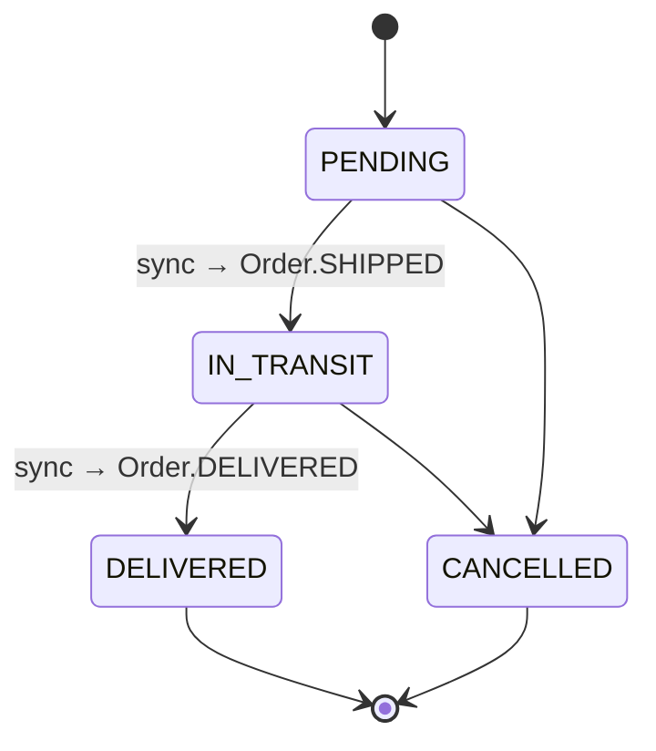

### 2.6 Produit (`Product`)

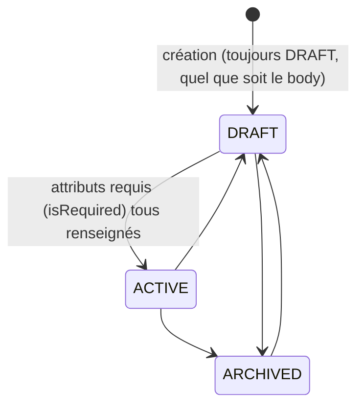

Règles clés :

- Changer `categoryId` purge les `ProductAttributeValue`, désactive les combinaisons, et repasse le produit en `DRAFT` (comportement décrit dans le guide d'intégration §6.2).
- `DRAFT → ACTIVE` déclenche `product.activated` sur l'event bus (avertissement non bloquant si le produit a des attributs variantes sans combinaison active).

### 2.7 Combinaison (`ProductCombination.isActive`)

Pas d'enum — booléen piloté par `combination.service.ts::generate()` (régénération idempotente du produit cartésien des sélections) ou `PATCH` manuel. Désactivation **non bloquée** même avec stock actif, mais tracée (`combination.deactivated` → `COMBINATION_DEACTIVATED_WITH_STOCK`).

### 2.8 Promotion (`PromotionStatus`) — calculé, pas stocké

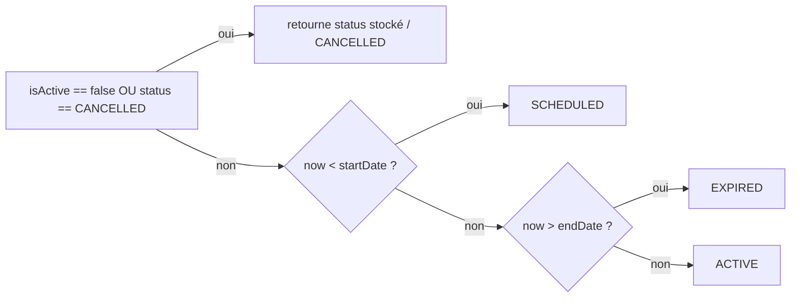

Le champ `status` en base n'est qu'un indicatif de départ — **toute lecture** (`promotion.service.ts`, `dashboard.service.ts`) recalcule via `computeDisplayStatus(promotion)`. Le frontend ne doit jamais se fier à un `status` mis en cache côté client.

---

## 3. Interactions entre modules — Event Bus

Le bus interne (`src/shared/events/event-bus.ts`, basé sur `EventEmitter`) découple les domaines. Un service **émet un fait**, des listeners dédiés (un fichier par domaine réactif dans `src/shared/events/listeners/`) réagissent, sans import croisé entre modules métier.

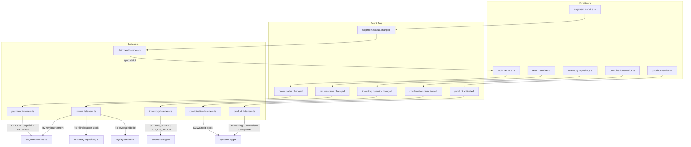

### Règles observées (catalogue)

| Règle               | Événement source                      | Effet                                                                                                        |
| ------------------- | ------------------------------------- | ------------------------------------------------------------------------------------------------------------ |
| R1                  | `order.status.changed` → `DELIVERED`  | Paiements COD `PENDING` liés → `COMPLETED`                                                                   |
| Sync Shipment→Order | `shipment.status.changed`             | `IN_TRANSIT`→`Order.SHIPPED`, `DELIVERED`→`Order.DELIVERED`                                                  |
| R2                  | `return.status.changed` → `COMPLETED` | Paiements `COMPLETED` liés → `REFUNDED`                                                                      |
| R3                  | `return.status.changed` → `COMPLETED` | Réintégration stock via `OrderItemReservation` (FIFO inverse)                                                |
| R4                  | `return.status.changed` → `COMPLETED` | Reversal des points de fidélité gagnés sur la commande                                                       |
| S1                  | `inventory.quantity.changed`          | `LOW_STOCK` / `OUT_OF_STOCK` (seuil configurable)                                                            |
| S3                  | `combination.deactivated`             | Trace `COMBINATION_DEACTIVATED_WITH_STOCK` (non bloquant)                                                    |
| S4                  | `product.activated`                   | Trace `PRODUCT_ACTIVATED_WITHOUT_COMBINATIONS` si attributs variantes sans combinaison active (non bloquant) |

### Règle d'or anti-cycle

Les services métier importent **uniquement** `event-bus.ts` + `event-types.ts` directement. Ils n'importent **jamais** `shared/events/index.ts` (qui importe les listeners, qui importent les services → cycle). `index.ts` n'est chargé qu'une fois, au démarrage (`app.ts::registerEventListeners()`).

### Gestion des erreurs

Aucune erreur de listener n'est avalée silencieusement :

- Filet générique : `event-bus.ts` capture toute erreur (sync ou Promise rejetée) → `systemLogger.error('EVENT_LISTENER_FAILED', ...)`.
- Filet spécifique métier : chaque listener applicatif logue aussi `ORDER_SYNC_FAILED` avec le contexte précis (orderId, returnRequestId...).

---

## 4. Jobs & automatisation

```mermaid
gantt
    dateFormat  X
    axisFormat %s
    section Jobs internes (node-cron)
    pickup-expiration (*/15 min)     :active, 0, 1
    order-expiration (hourly)         :active, 0, 4
    settings-refresh (*/5 min)        :active, 0, 1
```

| Job               | Fichier                                | Fréquence               | Rôle                                                                                                                                                             |
| ----------------- | -------------------------------------- | ----------------------- | ---------------------------------------------------------------------------------------------------------------------------------------------------------------- |
| Pickup expiration | `shared/jobs/pickup-expiration.job.ts` | `*/15 * * * *` (15 min) | Détecte les `PickupRequest` dont `deadline` est dépassée → `EXPIRED`, annule en cascade le `ReturnRequest` lié                                                   |
| Order expiration  | `shared/jobs/order-expiration.job.ts`  | `0 * * * *` (horaire)   | Annule les `Order` `PENDING` non payées au-delà de `orders.stale_pending_hours` (24h par défaut), libère le stock réservé                                        |
| Settings refresh  | `shared/jobs/settings-refresh.job.ts`  | `*/5 * * * *` (5 min)   | Filet de sécurité : rafraîchit le snapshot synchrone des settings (utilisé par `pagination.ts`, `countries.ts`, `multer.ts`) même sans requête HTTP déclenchante |

Tous démarrés dans `server.ts::bootstrap()` après `settingService.warmup()`, et arrêtés proprement sur `SIGTERM`/`SIGINT`.

Les deux premiers jobs ont aussi un **équivalent endpoint manuel** pour déclenchement à la demande (utile pour tests / vérification) :

- `POST /pickup-requests/expire-overdue` (Admin)
- `POST /orders/expire-stale` (Admin)

### Flux temporel — commande abandonnée

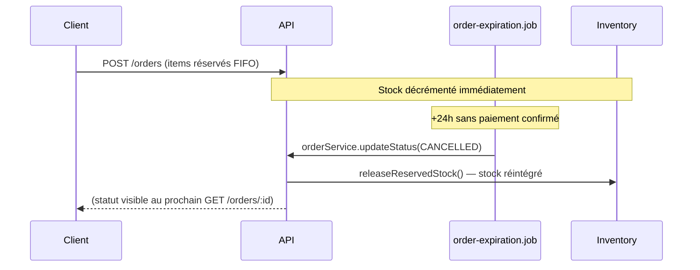

---

## 5. Module Settings — configuration à chaud

Toutes les valeurs métier variables (seuils, méthodes de paiement actives, pays supportés, limites d'upload, etc.) sont pilotées par le module `Setting`, lisible/écrivable via `GET/PATCH /settings`. Deux modes d'accès côté code :

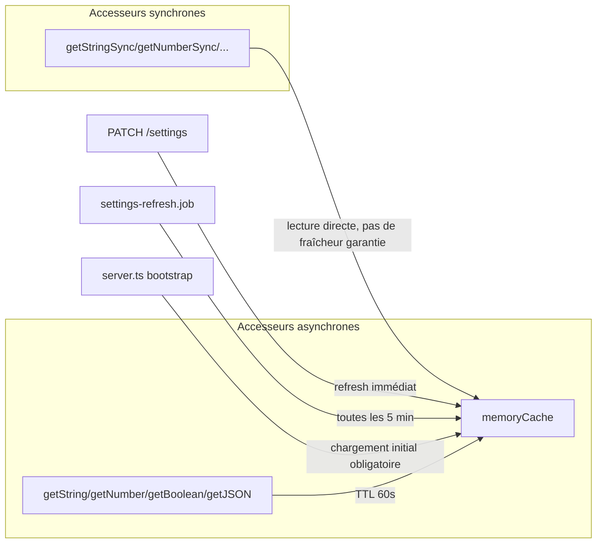

Les accesseurs synchrones (`pagination.ts`, `countries.ts`, `multer.ts`) **exigent** un `warmup()` réussi au démarrage — sinon fallback vers la valeur codée en dur passée en paramètre.

---

## 6. Résumé — qui dépend de qui

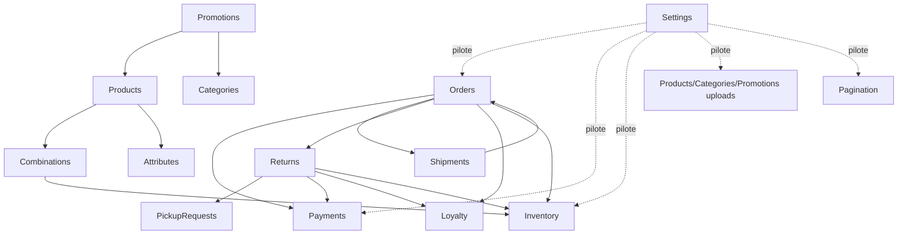

---

_Ce document complète `GUIDE_INTEGRATION_API_FRONTEND.md` (endpoints détaillés) avec la vue systémique : états, transitions, événements et automatisations._
