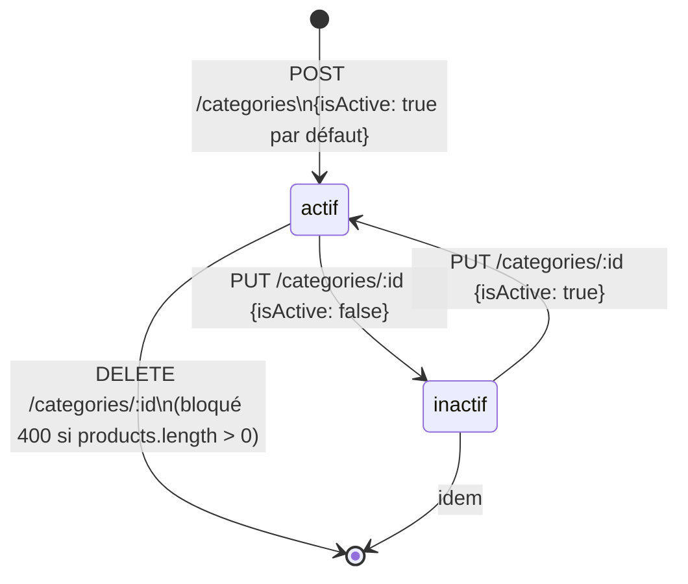
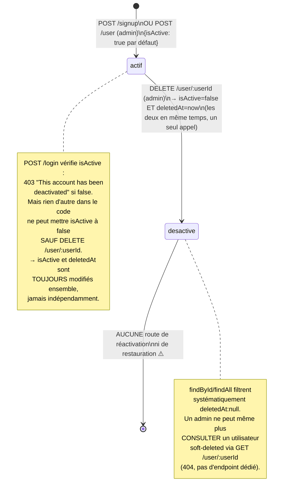

# Guide de gestion des statuts — Category, User (isActive / deletedAt / lockout)

> Document établi exclusivement à partir de la lecture du code (`category.service.ts`, `category.repository.ts`, `user.service.ts`, `user.repository.ts`, `auth.service.ts`, `auth-guard.ts`, `logger.types.ts`). Complète l'inventaire des cycles de statuts après les guides Order/Payment/Shipment/Return, Product/Combination/Inventory, et Promotion/Coupon/Loyalty/Pickup.

---

## 1. `Category.isActive`

Champ booléen, `@default(true)`. Aucune state machine — juste un flag.

⚠️ **Constat** : le flag existe, se modifie normalement via `PUT`, mais **n'est vérifié nulle part** dans le reste du code.

- `categoryRepository.findAll()` ne filtre pas sur `isActive` — une catégorie désactivée apparaît identiquement dans `GET /categories`.
- `categoryRepository.findProducts()` (via slug) ne filtre pas non plus — les produits d'une catégorie désactivée restent listables et achetables normalement.
- `productService.create()` ne vérifie pas que la `categoryId` fournie correspond à une catégorie active.
- Aucune cascade : désactiver une catégorie ne désactive pas ses produits, et la catégorie parent désactivée n'affecte pas ses enfants.

En l'état, `isActive` sur `Category` est un champ **purement déclaratif**, sans aucun effet fonctionnel observable.

---

## 2. `User.isActive` / `User.deletedAt`

Deux mécanismes distincts qui se chevauchent partiellement.

⚠️ **Constat n°1** : `isActive` et `deletedAt` sont conceptuellement deux mécanismes différents (suspension temporaire vs suppression définitive) mais le code actuel ne les distingue jamais — `userService.deleteUser()` les pose en même temps, et rien ne permet de suspendre un compte sans le soft-supprimer, ni de le réactiver après coup.

⚠️ **Constat n°2** : `logger.types.ts::UserEvent` définit `"ACCOUNT_LOCKED" | "ACCOUNT_UNLOCKED"`, et `SecurityEvent` définit `"MULTIPLE_FAILED_LOGINS" | "BRUTE_FORCE_DETECTED"`. **Aucun de ces quatre événements n'est émis nulle part dans le code.** `authService.login()` logge bien `FAILED_LOGIN` à chaque échec, mais ne compte jamais les tentatives consécutives, ne verrouille jamais un compte, et ne journalise jamais de détection de brute-force. Ce sont des types définis pour une fonctionnalité qui n'a jamais été implémentée.

**Conditions par transition (état réel du code) :**

| De → Vers                                      | Déclencheur                  | Garde-fou                                           |
| ---------------------------------------------- | ---------------------------- | --------------------------------------------------- |
| création → actif                               | `POST /signup`, `POST /user` | —                                                   |
| actif → désactivé (isActive=false + deletedAt) | `DELETE /user/:userId`       | admin uniquement, toujours les deux champs ensemble |
| désactivé → actif                              | **Aucun**                    | Pas de route                                        |
| échecs de login répétés → verrouillage         | **Aucun**                    | Types d'événements définis, jamais utilisés         |

---

## 3. Tableau de relations croisées

| Événement source                     | Effet automatique existant                  | Lacune identifiée                                                                   |
| ------------------------------------ | ------------------------------------------- | ----------------------------------------------------------------------------------- |
| `Category.isActive → false`          | Aucun                                       | Produits et sous-catégories restent visibles/achetables normalement                 |
| `User.isActive → false` (via delete) | Bloque le login (403)                       | Pas de réactivation possible, pas de suspension indépendante de la suppression      |
| Échecs de login répétés              | `FAILED_LOGIN` loggé individuellement       | Aucun comptage, aucun verrouillage automatique malgré les types d'événements prévus |
| `User` soft-deleted                  | Invisible dans toutes les listes/recherches | Admin ne peut même plus consulter le compte pour investigation                      |

---

## 4. Constats & lacunes identifiées

1. **`Category.isActive` est un champ mort** — comme `Promotion.status` avant correction, il existe et se modifie, mais aucun chemin de lecture ne le respecte.
2. **`User.isActive` et `deletedAt` sont artificiellement couplés** — impossible de suspendre sans supprimer, ni de restaurer.
3. **Le lockout de compte est une fonctionnalité fantôme** — les types existent dans le schéma de logs (`ACCOUNT_LOCKED`, `ACCOUNT_UNLOCKED`, `MULTIPLE_FAILED_LOGINS`, `BRUTE_FORCE_DETECTED`), rien derrière.

---

## 5. Proposition d'automatisation

| Règle | Condition                                                    | Effet à automatiser                                                                                                                                     |
| ----- | ------------------------------------------------------------ | ------------------------------------------------------------------------------------------------------------------------------------------------------- |
| U1    | `Category.isActive = false`                                  | Exclure la catégorie de `findAll()` public et de `findProducts()` (garder l'accès admin via un futur flag `includeInactive`)                            |
| U2    | `DELETE /user/:userId`                                       | Découpler : n'imposer que `deletedAt` (suppression) ; ajouter une route distincte `PATCH /user/:userId/status {isActive}` pour la suspension réversible |
| U3    | `N` échecs de login consécutifs (ex. 5 en 15 min, via Redis) | `isActive → false` + log `ACCOUNT_LOCKED` + log `BRUTE_FORCE_DETECTED` si le seuil est franchi rapidement                                               |
| U4    | Admin déverrouille manuellement                              | Route `POST /user/:userId/unlock` → `isActive → true` + log `ACCOUNT_UNLOCKED`                                                                          |

### Recommandation

- **U1** : correction directe et sans risque dans `categoryRepository`, à faire indépendamment du reste — même famille que T5 (garde-fou warehouse) du guide précédent.
- **U2** est un changement de contrat (nouvelle route, nouveau schema Zod) — à valider avec toi avant implémentation puisque ça touche à la sémantique admin existante (`DELETE` ne fera plus qu'une seule chose).
- **U3/U4** nécessitent un compteur d'échecs (Redis, déjà disponible via `cache.ts` — clé `login_attempts:{username}`, TTL glissant). C'est la seule proposition des quatre guides qui introduit une vraie fonctionnalité de sécurité manquante plutôt qu'une correction de synchronisation — à prioriser selon ton appétit pour le risque (comptes non protégés contre le brute-force actuellement).
