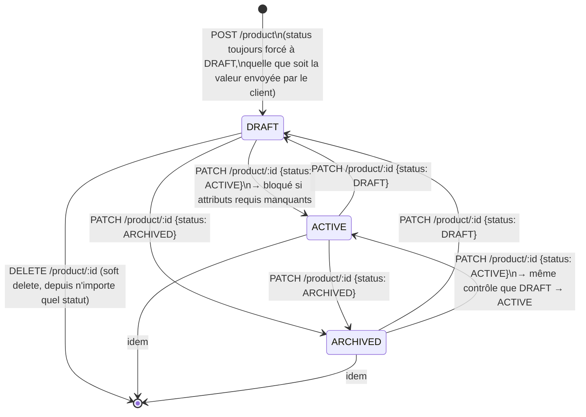
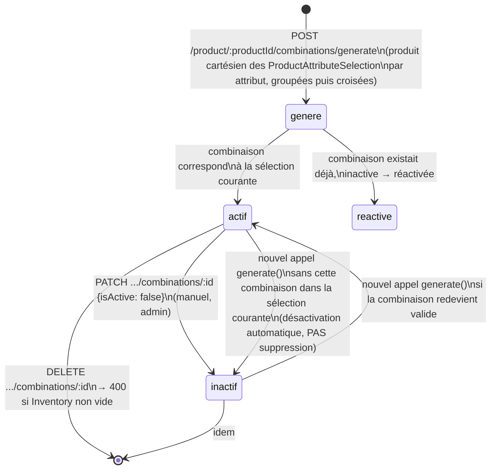
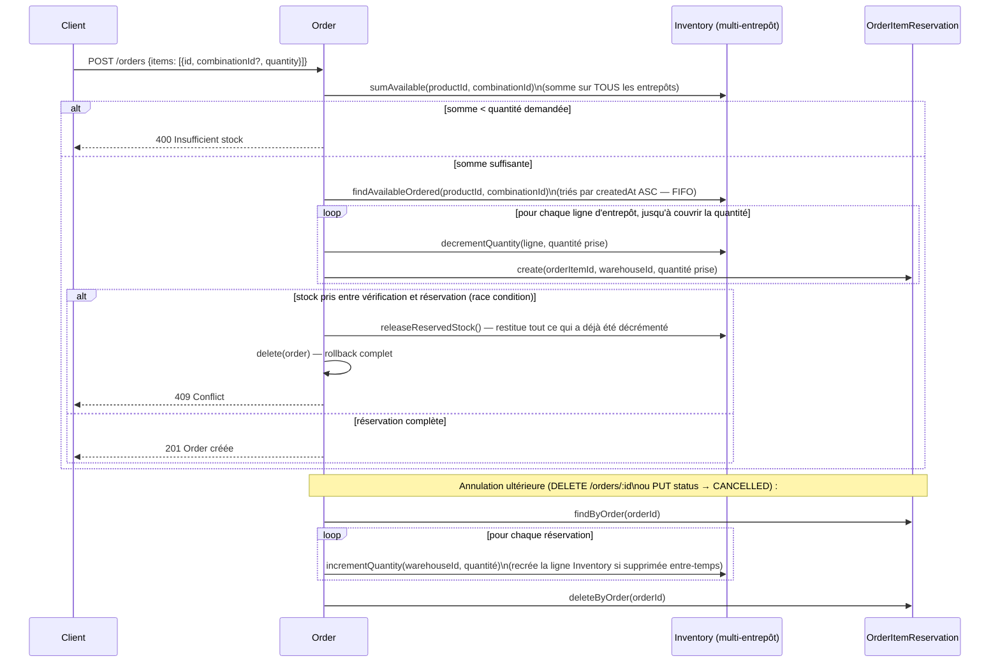

# Guide de gestion des statuts — Product, Attributs, Combinaisons, Stock (Inventory)

> Document établi exclusivement à partir de la lecture du code (`product.service.ts`, `attribute.service.ts`, `combination.service.ts`, `inventory.service.ts`, `warehouse.service.ts`, `order.service.ts`, `prisma/schema.prisma`). Aucune state machine formelle (type `order.state-machine.ts`) n'existe pour `Product`, `ProductCombination` ou `Inventory` — les garde-fous sont implémentés de façon ad-hoc, directement dans les services concernés.

---

## 1. Cycle de vie de `Product.status`

`ProductStatus` : `DRAFT` · `ACTIVE` · `ARCHIVED`.

⚠️ **Constat** : contrairement à `Order` et `Payment`, il n'existe **aucune restriction de transition** entre `DRAFT`/`ACTIVE`/`ARCHIVED` — tous les sens sont autorisés (`ACTIVE → DRAFT`, `ARCHIVED → ACTIVE`, etc.). Le seul garde-fou est `assertReadyForActivation()`, appelé uniquement quand la cible est `ACTIVE`.

**Garde-fou d'activation (`product.service.ts`)** :

- Récupère les `AttributeDefinition` de la catégorie du produit où `isVariant: false` et `isRequired: true`.
- Compare avec les `ProductAttributeValue` déjà renseignées sur le produit.
- S'il manque au moins un attribut requis → `400 Cannot activate product: missing required attributes (...)`.
- Les attributs de variante (`isVariant: true`) ne sont **jamais** concernés par ce contrôle — ils suivent un chemin séparé (§2.2).

**Suppression (`deletedAt`)** : soft delete, pas un statut à proprement parler. `findAll`/`findById` filtrent systématiquement `deletedAt: null`. Aucune vérification de stock ou de commandes en cours avant suppression — un produit avec de l'inventaire actif peut être soft-deleted sans avertissement.

---

## 2. Attributs — deux chemins totalement distincts

Un `AttributeDefinition` (rattaché à une `Category`) a un flag `isVariant`. Ce flag détermine complètement quel service le traite — **il n'y a aucun code partagé entre les deux chemins.**

### 2.1 Attribut produit (`isVariant: false`)

- Route : `PUT /product/:productId/attributes`
- Service : `attribute.service.ts` → `setProductAttributes()`
- Stocké dans `ProductAttributeValue` (une valeur texte libre par attribut, ex. `{ "Matière": "Coton" }`)
- Remplace **toutes** les valeurs à chaque appel (delete + recreate en transaction)
- Rejette explicitement si l'attribut ciblé a `isVariant: true` (message oriente vers le bon endpoint : `/combinations/selections/...`)
- C'est la seule source vérifiée par `assertReadyForActivation()` avant passage à `ACTIVE`

### 2.2 Attribut de variante (`isVariant: true`)

- Route : `PUT /product/:productId/combinations/selections/:attributeDefinitionId`
- Service : `combination.service.ts` → `setOptionsForAttribute()`
- Ne stocke pas une valeur mais une **sélection d'options** (`ProductAttributeSelection` : `productId` + `attributeDefinitionId` + `attributeOptionId`, un enregistrement par option choisie)
- Vérifie que chaque `optionId` fourni appartient bien à la définition d'attribut ciblée
- Rejette si l'attribut n'a **pas** `isVariant: true` (renvoie vers `/product/:productId/attributes`)
- Rejette si l'attribut n'appartient pas à la catégorie du produit
- **N'est jamais vérifié** par `assertReadyForActivation()` — un produit peut passer `ACTIVE` sans qu'aucune combinaison n'ait été générée

---

## 3. Cycle de vie d'une `ProductCombination`

**Mécanique de `generate()` (`combination.service.ts`)** :

1. Regroupe les `ProductAttributeSelection` du produit par `attributeDefinitionId`.
2. Calcule le produit cartésien de toutes les options sélectionnées (ex. `[S,M,L] × [Rouge,Bleu]` → 6 combinaisons).
3. Pour chaque combinaison générée : clé canonique triée (`optionsKey`) → recherche d'une combinaison existante.
   - Existe et inactive → réactivée.
   - Existe et active → ignorée (idempotent).
   - N'existe pas → créée.
4. Toute combinaison **non présente** dans le lot généré est désactivée (`deactivateManyExcept`) — jamais supprimée automatiquement.
5. Invalide le cache produit (`products:{id}`).

⚠️ **Constat** : désactiver une combinaison (`isActive: false`, manuel ou via `generate()`) **ne vérifie pas** si elle a du stock. Seule la **suppression** (`DELETE`) bloque avec 400 si `combination.inventory.length > 0`. Une combinaison désactivée avec du stock actif reste donc invisible côté client (le repository ne récupère que `combinations: { where: { isActive: true } }`) mais son inventaire continue d'exister silencieusement en base — ni alerte, ni blocage.

---

## 4. Gestion du stock multi-entrepôt (`Inventory`)

Clé composite : `(productId, warehouseId, combinationId)` — `combinationId` nullable pour un produit sans variante. Pas de sentinel (`@default("")`) sur ce champ dans le schéma actuel : le repository contourne la limitation Prisma (pas de `null` dans un `@@unique` pour `findUnique`) en utilisant `findFirst` quand `combinationId` est absent (`inventory.repository.ts::findByProductAndWarehouse`).

### 4.1 Opérations de base

| Opération         | Route                        | Effet                                          | Garde-fou                                                                                     |
| ----------------- | ---------------------------- | ---------------------------------------------- | --------------------------------------------------------------------------------------------- |
| Création          | `POST /inventory`            | Crée une ligne `Inventory`                     | 404 si produit/entrepôt introuvable, 409 si `(product, warehouse, combination)` déjà existant |
| Ajustement manuel | `PUT /inventory/:item_id`    | Modifie `quantity` et/ou `warehouse_id`        | Déclenche **alertes** `LOW_STOCK`/`OUT_OF_STOCK` (voir 4.2)                                   |
| Suppression       | `DELETE /inventory/:item_id` | Supprime la ligne                              | Aucune vérification de commandes en cours                                                     |
| Transfert         | `POST /inventory/transfer`   | Décrémente source, incrémente/crée destination | 400 si stock source insuffisant                                                               |

### 4.2 Alertes de stock — ⚠️ constat central

`inventory.service.ts::update()` compare l'ancienne et la nouvelle quantité et logge :

- `OUT_OF_STOCK` si nouvelle quantité `=== 0`
- `LOW_STOCK` si nouvelle quantité `<= 10` (seuil **hardcodé** `LOW_STOCK_THRESHOLD`, indépendant du paramètre `?threshold=` utilisé par `GET /inventory/low-stock` qui, lui, est ajustable)

**Ces alertes ne se déclenchent QUE via `PUT /inventory/:item_id`.** Or les deux mécanismes qui consomment le plus de stock au quotidien l'appellent **sans jamais passer par ce service** :

- `inventoryService.transfer()` appelle directement `inventoryRepository.decrementQuantity()` / `incrementQuantity()`.
- La réservation FIFO à la commande (`order.service.ts`, §5) appelle directement `inventoryRepository.decrementQuantity()`.

**Conséquence factuelle** : une commande qui fait passer un stock à 0, ou un transfert qui vide un entrepôt, ne génère **aucun** log `LOW_STOCK`/`OUT_OF_STOCK`. Seul un ajustement manuel admin déclenche l'alerte — ce qui couvre le cas d'usage le moins fréquent.

---

## 5. Interaction `Order` ↔ Stock — vérification et réservation

Basé sur `order.service.ts::create()` et `order.state-machine.ts` (transition `CANCELLED`).

**Points clés vérifiés dans le code :**

- La vérification de disponibilité est **globale** (somme tous entrepôts confondus), pas entrepôt par entrepôt — un produit disponible en petites quantités dispersées dans 5 entrepôts passe la vérification.
- La réservation est **FIFO stricte** sur `createdAt` de la ligne `Inventory` — pas de logique de proximité géographique ou de priorité d'entrepôt.
- `OrderItemReservation` trace précisément _quel entrepôt a donné quoi_ pour cette _ligne de commande_ — c'est cette table qui rend la restitution exacte possible à l'annulation.
- Cette même table existe et est peuplée pour **chaque commande livrée**, y compris celles avec un retour ultérieur — mais `return.service.ts` ne l'interroge jamais (voir §6).

---

## 6. Tableau de relations croisées

| Événement source                                    | Effet automatique existant                                              | Lacune identifiée                                                                                                                                                                                          |
| --------------------------------------------------- | ----------------------------------------------------------------------- | ---------------------------------------------------------------------------------------------------------------------------------------------------------------------------------------------------------- |
| `Product` créé                                      | `status` forcé à `DRAFT`, quel que soit le body                         | — (comportement voulu, comme `role` sur signup)                                                                                                                                                            |
| `Product.status → ACTIVE`                           | Bloqué si attributs produit requis manquants                            | Aucune vérification qu'au moins une combinaison existe/est active si le produit a des attributs `isVariant`                                                                                                |
| `AttributeDefinition` (variante) modifiée/supprimée | Aucune régénération automatique des combinaisons existantes             | Une combinaison peut référencer une option supprimée entre-temps côté définition (bien que `combinationSnapshot` sur `OrderItem` protège l'historique de commande)                                         |
| `combinations/generate()` relancé                   | Combinaisons obsolètes désactivées (pas supprimées)                     | Celles avec du stock restent invisibles côté client mais consomment toujours de l'espace en base sans alerte                                                                                               |
| `Inventory` décrémenté via commande ou transfert    | Rien                                                                    | **Pas d'alerte `LOW_STOCK`/`OUT_OF_STOCK`** (voir §4.2) — seul `PUT /inventory/:id` les déclenche                                                                                                          |
| `Order.status → CANCELLED`                          | Stock restitué précisément via `OrderItemReservation`                   | Aucun impact sur les combinaisons désactivées entre-temps (le stock revient même si la combinaison n'est plus active)                                                                                      |
| `ReturnRequest.status → COMPLETED`                  | `Order.status → REFUNDED` (voir guide précédent)                        | **Aucune réintégration de stock**, alors que `OrderItemReservation` contient déjà toute l'information nécessaire par `orderItemId` — commentaire dans `return.service.ts` affirmant l'inverse est obsolète |
| `Category` d'un produit                             | Non modifiable après création (`updateProductSchema` omet `categoryId`) | Cohérent avec l'immutabilité déjà actée — mais empêche de corriger une combinaison mal générée sans recréer le produit                                                                                     |

---

## 7. Constats & lacunes identifiées (résumé)

1. **Alertes de stock structurellement incomplètes** : elles ne couvrent que le chemin d'ajustement manuel admin, pas les deux chemins de consommation réels (commande, transfert). C'est le constat le plus actionnable de ce document.
2. **Aucune state machine pour `Product.status`** : n'importe quelle transition est possible hors activation. Pas nécessairement un problème (moins de cas d'usage sensibles qu'`Order`), mais à surveiller si `ARCHIVED` doit un jour bloquer certaines actions (ex. commande d'un produit archivé — non vérifié actuellement à la commande, seul `deletedAt` est filtré).
3. **Désactivation de combinaison non gardée par le stock** — asymétrie avec la suppression, qui elle est bloquée.
4. **`ReturnRequest.status = COMPLETED` ignore le stock déjà tracé** — la donnée existe (`OrderItemReservation`), le code ne l'exploite pas. Recoupe directement la lacune déjà identifiée dans le guide Order/Payment/Shipment/Return (réintégration de stock différée, item 1 des décisions métier en attente).
5. **Aucune vérification qu'un produit avec attributs de variante a au moins une combinaison active avant `ACTIVE`** — un produit "variantisé" peut être activé et vendu sans qu'aucune combinaison achetable n'existe (la commande échouerait alors seulement à l'étape `combination not found`).

---

## 8. Proposition d'automatisation

### 8.1 Règles concrètes à ajouter

| Règle | Condition                                                                                                                       | Effet à automatiser                                                                                                                                                                                    |
| ----- | ------------------------------------------------------------------------------------------------------------------------------- | ------------------------------------------------------------------------------------------------------------------------------------------------------------------------------------------------------ |
| S1    | `inventoryRepository.decrementQuantity()` appelé (transfert ou réservation commande) et la quantité résultante `<= 10` ou `= 0` | Émettre les mêmes logs `LOW_STOCK`/`OUT_OF_STOCK` qu'`inventoryService.update()` — actuellement dupliqués nulle part ailleurs                                                                          |
| S2    | `ReturnRequest.status → COMPLETED`                                                                                              | Relire `OrderItemReservation` par `orderItemId` des `ReturnItem` concernés → réintégrer le stock exact, entrepôt par entrepôt (même logique que `releaseReservedStock()`, déjà écrite et réutilisable) |
| S3    | `combinations/generate()` désactive une combinaison qui a du stock actif                                                        | Logger un avertissement dédié (`COMBINATION_DEACTIVATED_WITH_STOCK`) plutôt que de le faire silencieusement                                                                                            |
| S4    | `Product.status → ACTIVE` sur un produit ayant des `AttributeDefinition` `isVariant: true` dans sa catégorie                    | Vérifier qu'au moins une `ProductCombination` `isActive: true` existe, sinon avertir (400 bloquant, ou warning selon la décision métier)                                                               |

### 8.2 Options techniques

Le constat clé ici diffère du guide précédent : il ne s'agit pas de propager un changement de statut entre entités indépendantes, mais de **centraliser une logique déjà écrite mais dupliquée à moitié** (les alertes de stock n'existent qu'à un seul endroit d'appel sur trois).

**Option A — Déplacer la logique d'alerte dans le repository ou un helper partagé (effort minimal, recommandé en premier)**
Extraire la comparaison "ancienne quantité vs nouvelle quantité → alerte" hors de `inventoryService.update()` dans une fonction utilitaire `checkStockThresholds(item, oldQty, newQty)`, appelée systématiquement après `decrementQuantity`/`incrementQuantity`, quel que soit l'appelant (transfert, commande, ajustement manuel).
✅ Résout S1 directement, cohérent avec le style actuel, zéro nouvelle dépendance.
❌ Reste un appel synchrone de plus dans le chemin critique de création de commande (négligeable en pratique, un simple `if` + log Winston).

**Option B — Event bus interne** (comme proposé dans le guide précédent pour Order/Payment/Shipment/Return)
Si l'event bus est mis en place pour R1/R2 du guide précédent, S1 à S4 s'y intègrent naturellement comme listeners supplémentaires (`stock.quantity.changed`, `combination.deactivated`, `product.activation.requested`) — mutualise l'infrastructure plutôt que de la dupliquer pour chaque domaine.
✅ Un seul mécanisme à maintenir pour toutes les règles de propagation du projet (Order/Payment/Shipment/Return **et** Product/Combination/Inventory).
❌ Ne vaut le coût d'implémentation que si l'event bus est de toute façon construit pour l'autre guide — ne pas le justifier uniquement pour ces 4 règles.

**Option D (reprise du guide précédent) — Job de réconciliation planifié**
Un cron qui recalculerait périodiquement les seuils de stock sur l'ensemble des `Inventory` (filet de sécurité si S1 n'est pas implémenté partout) et qui vérifierait la cohérence combinaison/stock (S3).
✅ Complément peu coûteux, ne dépend d'aucun refactor.
❌ Détection différée, pas temps réel.

### 8.3 Recommandation

1. **Immédiat** : Option A pour S1 — c'est un bug de couverture, pas un choix d'architecture, et la correction est locale à `inventory.repository.ts`/`inventory.service.ts`.
2. **S2 est prioritaire métier** : recoupe directement la décision en attente sur la réintégration de stock au retour (guide précédent, §4 et §7). Une seule implémentation répond aux deux documents.
3. **S3 et S4** : peu coûteux à ajouter en même temps que S1/S2, mais moins urgents — à trancher avec toi selon si ce sont des cas rencontrés en pratique ou uniquement théoriques à ce stade.
4. Si l'event bus du guide précédent est construit, migrer S1-S4 dessus dans la foulée plutôt que de garder deux styles de propagation différents dans la codebase.

Dis-moi si tu veux qu'on commence par S1 (alertes de stock) ou par S2 (réintégration de stock au retour, qui ferme une dette commune aux deux documents).
