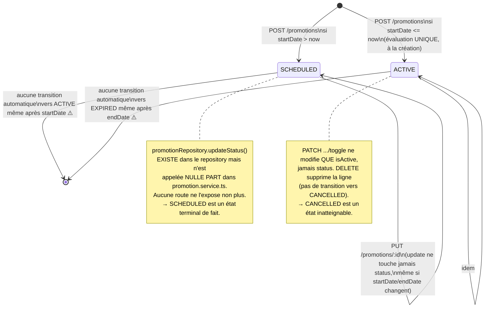
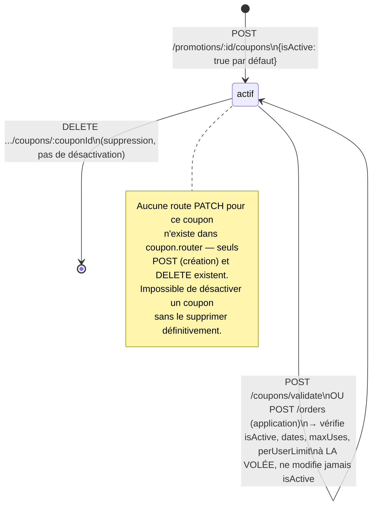
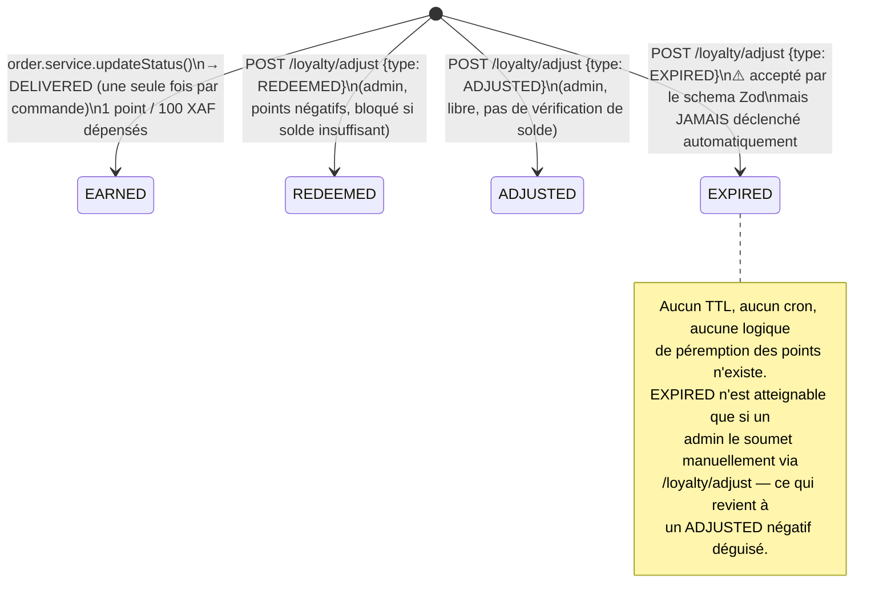
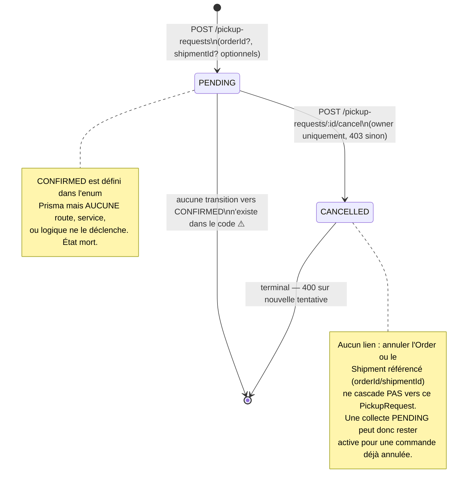

# Guide de gestion des statuts — Promotions, Coupons, Fidélité, Collectes (Pickup)

> Document établi exclusivement à partir de la lecture du code (`promotion.service.ts`, `promotion.repository.ts`, `promotion.pricing.ts`, `loyalty.service.ts`, `shipment.service.ts`, `shipment.repository.ts`, `warehouse.service.ts`, `prisma/schema.prisma`). Contrairement à `Order`/`Payment`, ces entités n'ont **aucune state machine**, et certaines valeurs d'enum sont purement décoratives : définies dans le schéma mais jamais atteignables par le code actuel.

---

## 1. Cycle de vie de `Promotion.status`

`PromotionStatus` : `SCHEDULED` · `ACTIVE` · `EXPIRED` · `CANCELLED`.

⚠️ **Constat critique** : `promotion.pricing.ts::isPromotionActiveNow()` et `promotion.repository.ts::findActiveDiscounts()` exigent **littéralement** `status === "ACTIVE"` en plus des dates et de `isActive`. Conséquence vérifiable :

- Une promotion créée avec `startDate` dans le futur (`status: SCHEDULED`) **n'appliquera jamais aucune remise**, même une fois `startDate` dépassée, tant que personne n'appelle manuellement une méthode qui n'est exposée par aucun endpoint.
- Une promotion `ACTIVE` dont `endDate` est dépassée continue d'apparaître comme `ACTIVE` dans `GET /promotions` (le champ n'est jamais recalculé), alors que `findActiveDiscounts()` l'exclut déjà correctement du pricing grâce au filtre sur les dates. Le champ `status` en base **ment** à l'admin sans impacter le comportement réel — c'est une désynchronisation d'affichage, pas de logique métier.

**Conditions par transition (état réel du code) :**

| De → Vers                        | Déclencheur                    | Garde-fou                                                                  |
| -------------------------------- | ------------------------------ | -------------------------------------------------------------------------- |
| création → `SCHEDULED`/`ACTIVE`  | `POST /promotions`             | Évaluation one-shot de `startDate` vs `now`, jamais réévaluée              |
| `* → ACTIVE` (après `SCHEDULED`) | **Aucun**                      | `updateStatus()` existe côté repository, inutilisé côté service, non routé |
| `* → EXPIRED`                    | **Aucun**                      | Jamais appelé                                                              |
| `* → CANCELLED`                  | **Aucun**                      | Jamais appelé — `DELETE` supprime la ligne au lieu d'y transiter           |
| `isActive` toggle                | `PATCH /promotions/:id/toggle` | Indépendant de `status`, n'affecte que le booléen                          |

---

## 2. Cycle de vie de `CouponCode.isActive`

Pas d'enum de statut — un simple booléen `isActive`, plus `usedCount`/`maxUses`/`startDate`/`endDate` évalués **dynamiquement à chaque validation**, jamais persistés.

⚠️ **Constat** : `usedCount >= maxUses` ou `endDate` dépassée ne mettent **jamais** `isActive` à `false`. Le coupon reste visible comme actif dans `GET /promotions/:id/coupons` même épuisé ou expiré — seule la validation dynamique (`validateCoupon`) bloque son usage réel. Comme pour `Promotion.status`, c'est un problème d'affichage/traçabilité admin plus que de sécurité fonctionnelle (le blocage métier fonctionne), mais ça rend le monitoring peu fiable.

---

## 3. Cycle de vie de `LoyaltyTransaction.type`

`LoyaltyEventType` : `EARNED` · `REDEEMED` · `EXPIRED` · `ADJUSTED`.

⚠️ **Constat** : `getBalance()` fait un simple `SUM(points)` sur toutes les transactions sans distinction de type ni de date — un point `EARNED` il y a 3 ans compte autant qu'un point crédité hier. Aucune notion de durée de vie des points n'est implémentée, malgré la présence du type `EXPIRED` dans le schéma.

---

## 4. Cycle de vie de `PickupRequest.status`

`PickupStatus` : `PENDING` · `CONFIRMED` · `CANCELLED`.

**Conditions par transition :**

| De → Vers                                 | Déclencheur                        | Garde-fou                                                        |
| ----------------------------------------- | ---------------------------------- | ---------------------------------------------------------------- |
| création → `PENDING`                      | `POST /pickup-requests`            | —                                                                |
| `PENDING → CANCELLED`                     | `POST /pickup-requests/:id/cancel` | 403 si pas owner, 400 si déjà `CANCELLED`                        |
| `* → CONFIRMED`                           | **Aucun**                          | État inatteignable                                               |
| `Order/Shipment` annulé → `PickupRequest` | **Aucun**                          | Pas de cascade, malgré les FK `orderId`/`shipmentId` disponibles |

---

## 5. Bonus — suppression d'un `Warehouse` (pas un statut, mais la même famille de lacune)

`warehouseService.delete()` appelle directement `prisma.warehouse.delete()`. Le schéma définit `onDelete: Cascade` sur `Inventory.warehouseId` **et** sur `OrderItemReservation.warehouseId`.

⚠️ **Constat** : supprimer un entrepôt qui contient encore du stock actif le fait disparaître silencieusement (pas de vérification `inventory.length > 0` avant suppression, contrairement à ce qui existe pour `ProductCombination`). Plus grave : les lignes `OrderItemReservation` historiques pointant vers cet entrepôt sont supprimées elles aussi — l'audit trail d'une commande déjà livrée perd la trace de quel entrepôt a fourni quoi.

---

## 6. Tableau de relations croisées

| Événement source                      | Effet automatique existant                                | Lacune identifiée                                                                |
| ------------------------------------- | --------------------------------------------------------- | -------------------------------------------------------------------------------- |
| `Promotion.startDate` atteinte        | Aucun                                                     | `status` reste `SCHEDULED`, promotion invisible au pricing malgré la date passée |
| `Promotion.endDate` dépassée          | Aucun (exclue du pricing via filtre date)                 | `status` reste `ACTIVE` en base — affichage admin trompeur                       |
| `CouponCode.usedCount = maxUses`      | Aucun                                                     | `isActive` reste `true`, aucune route pour le corriger manuellement              |
| `CouponCode.endDate` dépassée         | Aucun                                                     | idem                                                                             |
| `Order.status → DELIVERED`            | `LoyaltyTransaction(EARNED)` créée                        | Aucune expiration programmée de ces points                                       |
| `Order/Shipment → CANCELLED`          | Aucun                                                     | `PickupRequest` lié (`orderId`/`shipmentId`) reste `PENDING`                     |
| `Warehouse` supprimé avec stock actif | Cascade silencieuse (`Inventory`, `OrderItemReservation`) | Aucune alerte, aucun blocage, perte d'historique de réservation                  |

---

## 7. Constats & lacunes identifiées

1. **`Promotion.status` est un champ mort après création** — la seule méthode qui pourrait le faire évoluer (`promotionRepository.updateStatus`) n'est jamais appelée. C'est le constat le plus grave de ce document : il peut bloquer une promotion légitime programmée à l'avance.
2. **`CouponCode` n'a pas de route de mise à jour** — impossible de désactiver un coupon autrement qu'en le supprimant.
3. **`EXPIRED` (loyalty) et `CONFIRMED` (pickup) sont des valeurs d'enum inatteignables** par le code actuel — soit dead code, soit fonctionnalité jamais terminée.
4. **Aucune cascade `Order/Shipment → PickupRequest`** malgré les FK existantes.
5. **Suppression de `Warehouse` sans garde-fou de stock**, contrairement au traitement déjà correct des `ProductCombination` (bloquées par 400 si inventaire non vide).

---

## 8. Proposition d'automatisation

### 8.1 Règles concrètes à ajouter

| Règle | Condition                                                                                              | Effet à automatiser                                                                      |
| ----- | ------------------------------------------------------------------------------------------------------ | ---------------------------------------------------------------------------------------- |
| T1    | `Promotion.startDate <= now` et `status = SCHEDULED`                                                   | `status → ACTIVE`                                                                        |
| T2    | `Promotion.endDate < now` et `status = ACTIVE`                                                         | `status → EXPIRED`                                                                       |
| T3    | `CouponCode.usedCount >= maxUses` (après incrément) OU `endDate < now`                                 | `isActive → false`                                                                       |
| T4    | `Order.status → CANCELLED` ou `Shipment.status → CANCELLED` et `PickupRequest` lié existe en `PENDING` | `PickupRequest.status → CANCELLED`                                                       |
| T5    | `Warehouse` visé par `DELETE` a `Inventory` avec `quantity > 0`                                        | Bloquer avec 400 (même logique que `ProductCombination`), au lieu de cascade silencieuse |

T1/T2 sont les plus urgentes : elles corrigent un comportement métier cassé (promotions planifiées jamais appliquées), pas juste un affichage.

### 8.2 Options techniques

**Option A — Recalcul à la lecture, pas de mutation en base (le plus simple pour T1/T2)**
Plutôt que d'écrire un `status` qui doit être tenu à jour, dériver le statut affiché à la volée dans `promotionService.getAll/getById` via une fonction pure `computeDisplayStatus(promotion)` basée sur `isActive` + dates — exactement ce que fait déjà `isPromotionActiveNow()` pour le pricing. Le champ `status` en base devient alors informatif/historique (ex: `CANCELLED` posé manuellement), plus jamais une source de vérité pour "est-ce actif maintenant".
✅ Zéro risque de désynchronisation, aucune tâche planifiée à maintenir, cohérent avec la logique de pricing déjà existante.
❌ Le champ `status` stocké en base devient trompeur si quelqu'un le lit directement en SQL sans repasser par le calcul — à documenter clairement.

**Option B — Job de réconciliation planifié (cron), pour T1/T2/T3**
Un `node-cron` qui tourne par ex. toutes les heures : recalcule `Promotion.status` selon les dates, désactive les coupons épuisés/expirés. Écrit réellement en base, donc cohérent même en lecture SQL directe.
✅ Le champ `status`/`isActive` reste une source de vérité fiable même hors de l'API.
❌ Décalage temporel (jusqu'à l'intervalle du cron) ; nouvelle tâche à surveiller.

**Option C — Étendre le pattern service-à-service existant, pour T4**
Comme pour R1/R2 du guide Order/Payment : dans `orderService.updateStatus()` et `shipmentService.updateStatus()`, après passage à `CANCELLED`, chercher les `PickupRequest` liés (`orderId`/`shipmentId`) et les annuler.
✅ Cohérent avec le style déjà en place pour la synchronisation Shipment→Order.
❌ Encore un peu plus de couplage inter-services (même remarque que dans le guide précédent).

**Option D — Garde-fou direct dans le repository, pour T5**
Ajouter dans `warehouseService.delete()` une vérification `prisma.inventory.count({ where: { warehouseId: id, quantity: { gt: 0 } } })` avant suppression, sur le modèle exact de `combinationService.delete()`.
✅ Correction ciblée, aucun nouveau concept introduit.
❌ Aucun — c'est strictly une correction manquante, pas un choix d'architecture à trancher.

### 8.3 Recommandation

1. **T1/T2 (Promotion)** : Option A — c'est un bug de logique, pas un besoin de tâche planifiée. Le pricing utilise déjà le bon calcul ; il suffit d'aligner l'affichage admin dessus plutôt que de multiplier les sources de vérité.
2. **T3 (Coupon)** : Option A également, par cohérence — calculer `effectiveIsActive` à la lecture plutôt que de dépendre d'un cron pour un champ qui n'a pas de conséquence fonctionnelle (la validation dynamique bloque déjà correctement l'usage).
3. **T4 (Pickup)** : Option C, à faire en même temps que R1/R2 du guide Order/Payment/Shipment/Return si l'event bus (Option B de ce guide-là) est construit — sinon, ajout ponctuel direct dans les deux services concernés.
4. **T5 (Warehouse)** : Option D, correction isolée et sans risque, à faire indépendamment du reste — c'est la seule des cinq qui touche à une perte de données silencieuse plutôt qu'à un statut mal affiché.

Dis-moi par lequel tu veux commencer — T5 (garde-fou warehouse) est le plus rapide et sans risque, T1/T2 (promotions) est le plus impactant côté métier.
