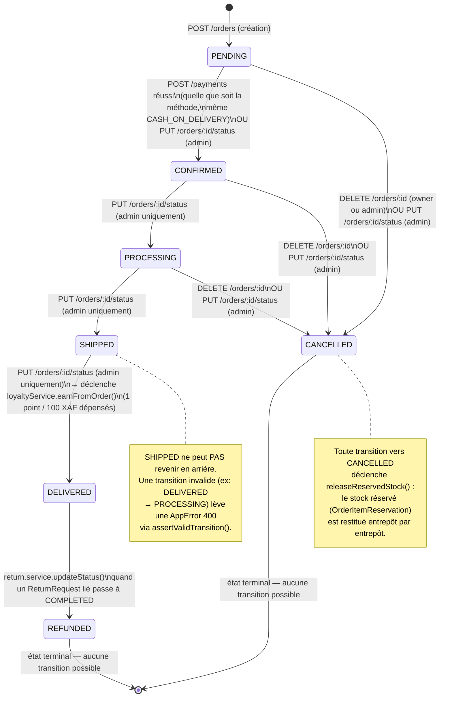
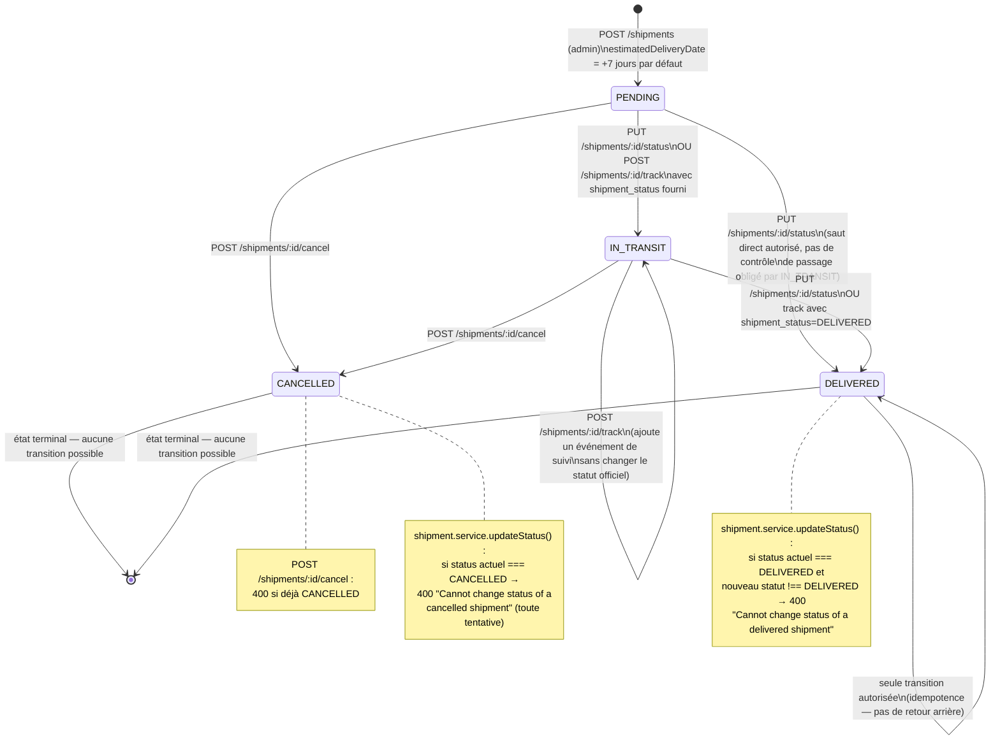
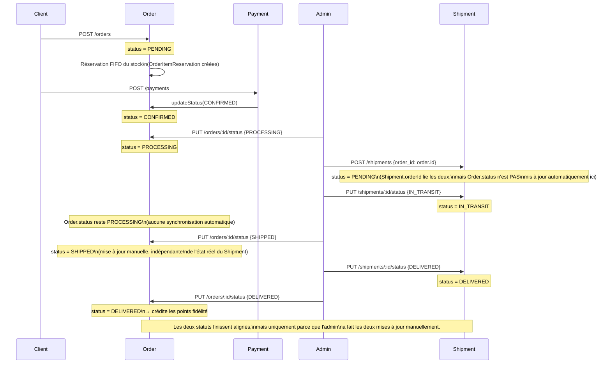

 Avant les diagrammes, une précision importante sur le code actuel : **`Order.status` et `Shipment.status` ne sont pas synchronisés automatiquement**. Ce sont deux machines à états indépendantes que l'admin fait évoluer manuellement chacune de son côté — je le note explicitement dans le 3ᵉ diagramme parce que ça change la lecture de "leur relation".

---

## 1. Cycle de vie de `Order.status`

Basé sur `order.state-machine.ts` (`TRANSITIONS`) et les appelants réels (`payment.service.ts`, `order.controller.ts`, `return.service.ts`).

**Résumé des conditions par transition :**

| De → Vers | Déclencheur | Garde-fou dans le code |
|---|---|---|
| `PENDING → CONFIRMED` | Paiement créé (`POST /payments`) ou admin | Aucune — toute méthode de paiement valide confirme, même COD non encaissé |
| `PENDING/CONFIRMED/PROCESSING → CANCELLED` | `DELETE /orders/:id` (owner ou admin) | `assertValidTransition` vérifie que l'état courant autorise `CANCELLED` |
| `CONFIRMED → PROCESSING`, `PROCESSING → SHIPPED`, `SHIPPED → DELIVERED` | `PUT /orders/:id/status` | Réservé à `adminGuard` |
| `SHIPPED → DELIVERED` | idem | Crédite les points fidélité une seule fois (vérifie `oldStatus !== DELIVERED`) |
| `DELIVERED → REFUNDED` | Retour complété | Piloté par `returnService`, pas directement par l'admin sur `/orders` |
| Toute transition non listée | — | `assertValidTransition` lève `400 Invalid order status transition: X -> Y` |

---

## 2. Cycle de vie de `Shipment.status`

Basé sur l'enum `ShipmentStatus` et les gardes dans `shipment.service.ts` (`updateStatus`, `cancel`, `addTrackingEvent`).

**Résumé des conditions par transition :**

| De → Vers | Déclencheur | Garde-fou dans le code |
|---|---|---|
| `PENDING → IN_TRANSIT/DELIVERED` | `PUT /shipments/:id/status` (admin) ou `POST /shipments/:id/track` avec `shipment_status` | Aucune restriction de saut (PENDING peut aller directement à DELIVERED) |
| `IN_TRANSIT → IN_TRANSIT` | `POST /shipments/:id/track` sans `shipment_status` | Ajoute juste une ligne `TrackingEvent`, ne touche pas au statut officiel |
| `* → CANCELLED` | `POST /shipments/:id/cancel` | 400 si déjà `CANCELLED` |
| `DELIVERED → *` (autre que DELIVERED) | — | Bloqué : 400 explicite |
| `CANCELLED → *` | — | Bloqué : 400 explicite |

---

## 3. Relation Order ↔ Shipment — ce qui existe réellement

### ⚠️ Point d'attention (pas une demande de correction, juste un constat factuel)

La seule vraie relation en base est `Shipment.orderId` (FK optionnelle). Il n'existe **aucun code qui propage automatiquement** un changement de `Shipment.status` vers `Order.status` ou inversement :

- Passer un `Shipment` à `DELIVERED` ne fait rien sur l'`Order` correspondant.
- Passer un `Order` à `SHIPPED`/`DELIVERED` ne vérifie pas que le `Shipment` associé existe ni qu'il est dans un état cohérent.
- Un admin pourrait donc marquer une commande `DELIVERED` alors que son expédition est encore `PENDING`, sans qu'aucune erreur ne soit levée.

Si vous voulez que je corrige ça (ex: `Shipment.status = DELIVERED` déclenche automatiquement `Order.status = DELIVERED` via `orderId`, ou qu'on bloque la transition `Order → SHIPPED` tant qu'aucun `Shipment` actif n'existe), dites-le-moi et je l'implémente comme les points précédents — mais je voulais d'abord que le diagramme reflète fidèlement ce qui existe, pas ce qui serait idéal.