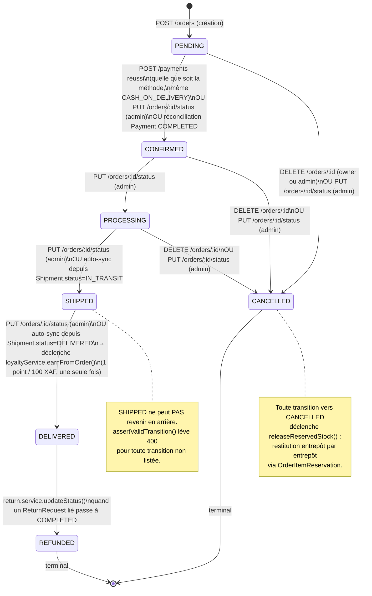
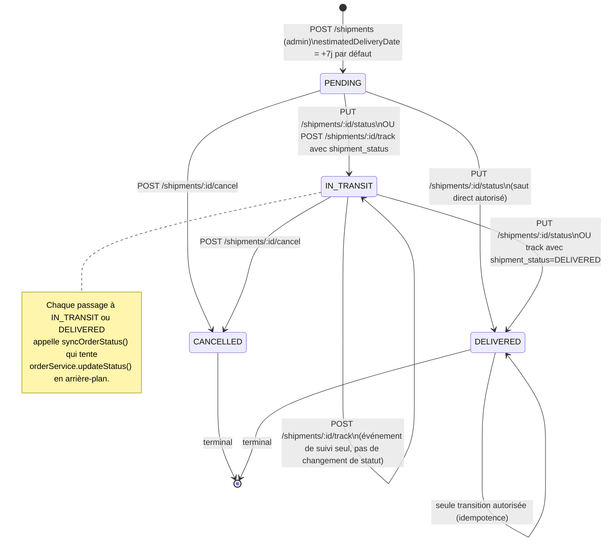
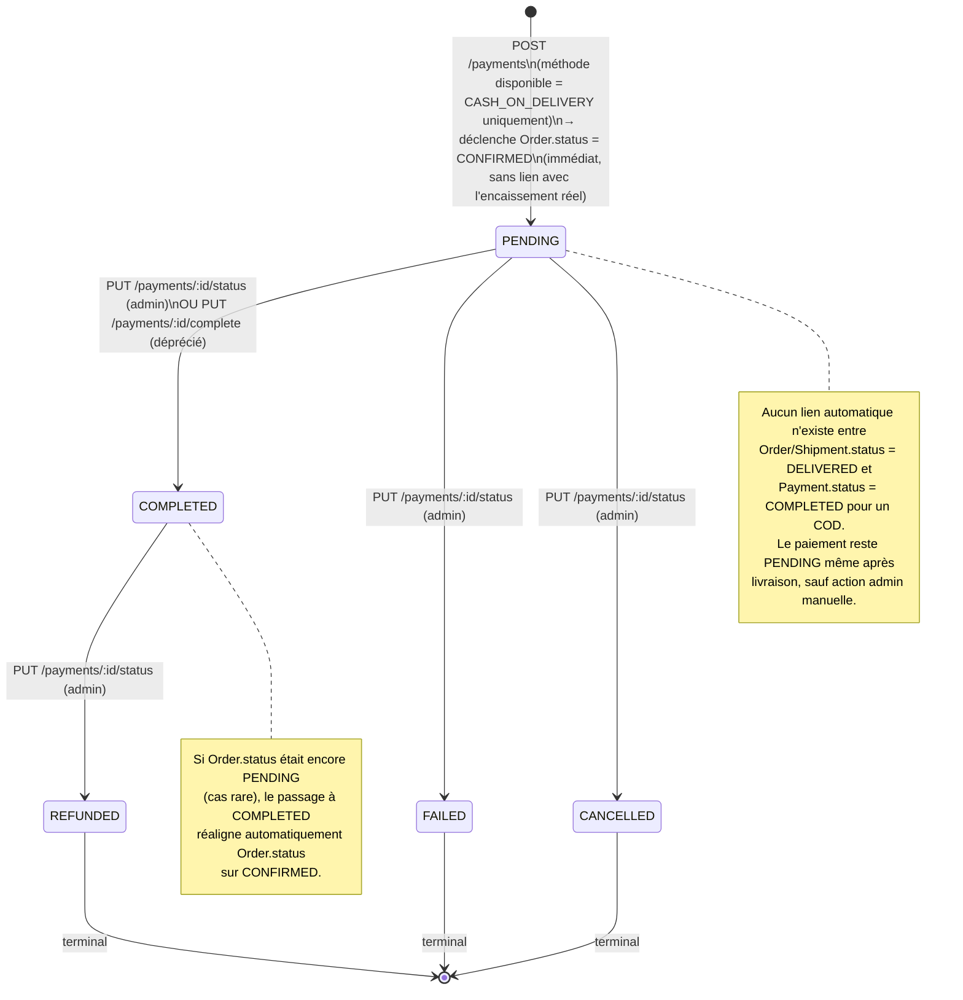
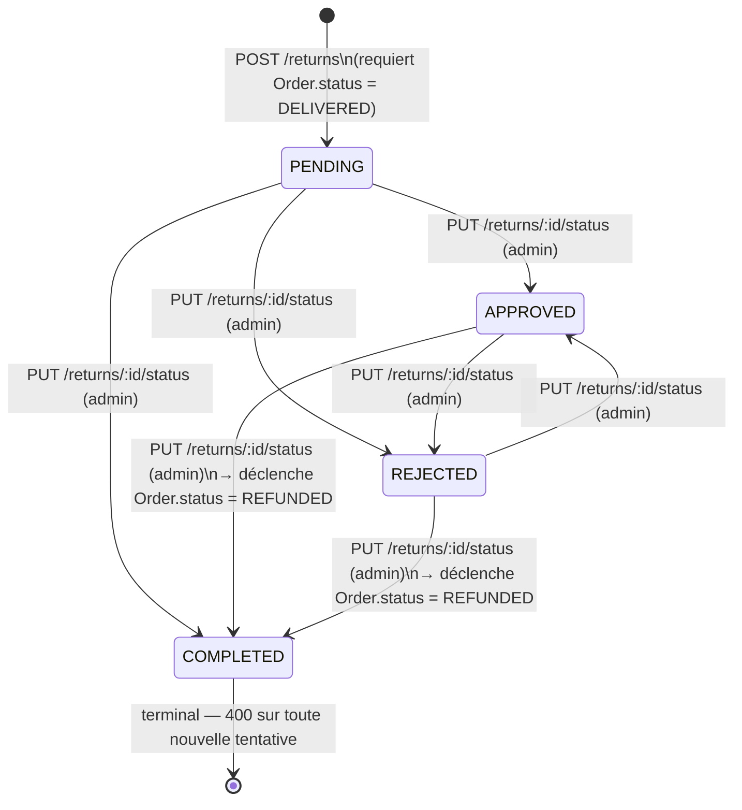
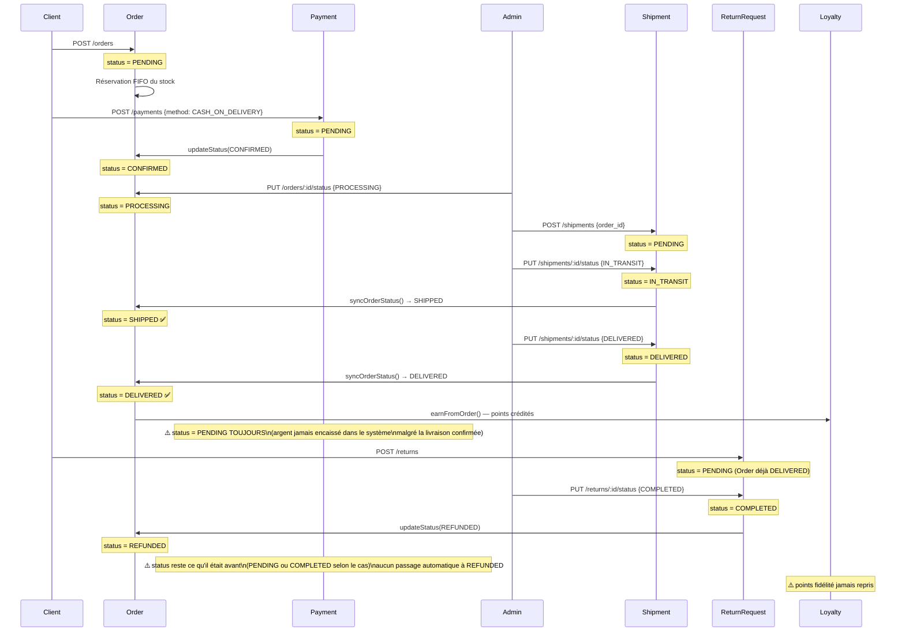

# Guide de gestion des statuts — Order, Shipment, Payment, Return

> Ce document est établi **exclusivement à partir de la lecture du code** (`order.state-machine.ts`, `payment.state-machine.ts`, `shipment.service.ts`, `return.service.ts`). Il décrit ce qui existe réellement, pas ce qui serait idéal. Les lacunes et incohérences sont signalées explicitement — ce ne sont pas des recommandations mais des constats.

⚠️ **CORRECTION par rapport à la version précédente de ce document** : l'affirmation initiale selon laquelle `Order.status` et `Shipment.status` ne sont "jamais synchronisés automatiquement" est **inexacte**. Le code contient une fonction `syncOrderStatus()` dans `shipment.service.ts` qui propage automatiquement certains changements de `Shipment.status` vers `Order.status` (voir §3). Cette synchronisation est partielle, best-effort, et silencieuse en cas d'échec — ce qui reste un point d'attention réel, détaillé plus bas.

---

## 1. Cycle de vie de `Order.status`

Basé sur `order.state-machine.ts` (`TRANSITIONS`) et les appelants réels.



**Conditions par transition :**

| De → Vers                                                               | Déclencheur                                  | Garde-fou                                                                           |
| ----------------------------------------------------------------------- | -------------------------------------------- | ----------------------------------------------------------------------------------- |
| `PENDING → CONFIRMED`                                                   | `POST /payments` (toute méthode) ou admin    | Aucune vérification d'encaissement réel — même un COD non payé confirme la commande |
| `PENDING/CONFIRMED/PROCESSING → CANCELLED`                              | `DELETE /orders/:id` (owner ou admin)        | `assertValidTransition`                                                             |
| `CONFIRMED → PROCESSING`, `PROCESSING → SHIPPED`, `SHIPPED → DELIVERED` | `PUT /orders/:id/status`                     | `adminGuard`                                                                        |
| `PROCESSING → SHIPPED`, `SHIPPED → DELIVERED`                           | **aussi** auto-sync depuis `Shipment.status` | `shipment.service.syncOrderStatus()` — **best-effort, échec silencieux** (voir §7)  |
| `DELIVERED → REFUNDED`                                                  | Retour `COMPLETED`                           | `return.service`, jamais directement via `/orders`                                  |

---

## 2. Cycle de vie de `Shipment.status`

Basé sur `ShipmentStatus` et les gardes de `shipment.service.ts`.



**Conditions par transition :**

| De → Vers                        | Déclencheur                                                        | Garde-fou                  |
| -------------------------------- | ------------------------------------------------------------------ | -------------------------- |
| `PENDING → IN_TRANSIT/DELIVERED` | `PUT /shipments/:id/status` (admin) ou `POST /shipments/:id/track` | Aucune restriction de saut |
| `* → CANCELLED`                  | `POST /shipments/:id/cancel`                                       | 400 si déjà `CANCELLED`    |
| `DELIVERED → *` (≠ DELIVERED)    | —                                                                  | Bloqué : 400               |
| `CANCELLED → *`                  | —                                                                  | Bloqué : 400               |

---

## 3. Cycle de vie de `Payment.status`

Basé sur `payment.state-machine.ts` (`TRANSITIONS`) et `payment.service.ts`.



**Conditions par transition :**

| De → Vers                              | Déclencheur                | Garde-fou                                                                                                                 |
| -------------------------------------- | -------------------------- | ------------------------------------------------------------------------------------------------------------------------- |
| création → `PENDING`                   | `POST /payments`           | 503 si méthode indisponible (PAYPAL/STRIPE/CINETPAY), 404 si commande introuvable, 403 si commande d'un autre utilisateur |
| `PENDING → COMPLETED/FAILED/CANCELLED` | `PUT /payments/:id/status` | `assertValidPaymentTransition`, réservé admin                                                                             |
| `COMPLETED → REFUNDED`                 | `PUT /payments/:id/status` | idem                                                                                                                      |
| `PUT /payments/:id/complete`           | —                          | ⚠️ Déprécié, alias de `{status: COMPLETED}`                                                                               |

---

## 4. Cycle de vie de `ReturnRequest.status`

Basé sur `ReturnStatus` et `return.service.ts`. **Il n'existe aucun fichier `return.state-machine.ts`** — contrairement à Order et Payment.



⚠️ **Point d'attention** : le seul garde-fou codé est _"le retour n'est pas déjà `COMPLETED`"_. Il n'existe **aucune validation de séquence logique** : un retour peut passer directement de `PENDING` à `COMPLETED`, ou de `REJECTED` à `APPROVED`, sans passer par un cheminement métier cohérent. C'est un comportement du code actuel, pas un choix documenté comme volontaire.

**Conditions par transition :**

| De → Vers             | Déclencheur               | Garde-fou                                                                                                        |
| --------------------- | ------------------------- | ---------------------------------------------------------------------------------------------------------------- |
| création → `PENDING`  | `POST /returns`           | Order doit être `DELIVERED` ; chaque `order_item_id` doit appartenir à la commande ; quantité ≤ quantité achetée |
| `* (≠ COMPLETED) → *` | `PUT /returns/:id/status` | Seul garde-fou : pas déjà `COMPLETED`                                                                            |
| `* → COMPLETED`       | idem                      | Déclenche `Order.status = REFUNDED` (transition `DELIVERED → REFUNDED`, valide côté Order)                       |

**Non implémenté à ce jour (décisions métier en attente — voir mémoire projet) :**

- Réintégration de stock au retour — alors que `OrderItemReservation` trace déjà l'entrepôt d'origine par `orderItemId` (le commentaire dans `return.service.ts` affirmant qu'"aucune information de warehouse n'est tracée" est **obsolète** : cette table existe depuis la refonte commandes/variantes/panier)
- Reversal des points de fidélité lorsqu'un retour complété annule une commande déjà livrée et créditée

---

## 5. Relations croisées entre les 4 entités

### 5.1 Tableau de synchronisation actuelle

| Événement source           | Statut déclencheur | Effet automatique existant                                             | Lacune identifiée                                                                                                  |
| -------------------------- | ------------------ | ---------------------------------------------------------------------- | ------------------------------------------------------------------------------------------------------------------ |
| `Payment` créé             | `PENDING`          | `Order.status → CONFIRMED` (immédiat, toute méthode)                   | Pour un COD, "confirmé" ne veut pas dire "encaissé" — source de confusion métier                                   |
| `Payment` mis à jour       | `COMPLETED`        | Si `Order.status` était encore `PENDING` → `CONFIRMED`                 | Aucun lien avec `DELIVERED`                                                                                        |
| `Shipment` mis à jour      | `IN_TRANSIT`       | `Order.status → SHIPPED` (best-effort)                                 | Échoue silencieusement si `Order.status` n'est pas `PROCESSING` (voir §6)                                          |
| `Shipment` mis à jour      | `DELIVERED`        | `Order.status → DELIVERED` (best-effort) → crédite les points fidélité | Idem — échec silencieux possible ; **`Payment.status` d'un COD n'est jamais mis à jour**                           |
| `Order` mis à jour         | `DELIVERED`        | Crédit fidélité (`loyaltyService.earnFromOrder`)                       | **`Payment.status` (COD) reste `PENDING`** — c'est exactement le cas décrit en introduction de cette demande       |
| `Order` mis à jour         | `CANCELLED`        | `releaseReservedStock()` — restitution du stock réservé                | Aucun impact sur `Payment` (un paiement `COMPLETED` sur une commande annulée n'est pas automatiquement `REFUNDED`) |
| `ReturnRequest` mis à jour | `COMPLETED`        | `Order.status → REFUNDED`                                              | **`Payment.status` n'est jamais mis à `REFUNDED`** ; pas de réintégration stock ; pas de reversal fidélité         |

### 5.2 Séquence complète (cas nominal COD)



---

## 6. Constats & lacunes identifiées

1. **Synchronisation `Shipment → Order` best-effort et silencieuse.** `syncOrderStatus()` est enveloppée dans un `try/catch` qui logge `ORDER_SYNC_FAILED` sans jamais faire remonter d'erreur à l'appelant. Concrètement : si un admin crée un `Shipment` pour une commande encore `CONFIRMED` (pas `PROCESSING`) et le passe à `IN_TRANSIT`, la tentative `orderService.updateStatus(orderId, SHIPPED)` échoue (transition invalide `CONFIRMED → SHIPPED`), l'erreur est engloutie, et **rien ne prévient l'admin que la synchronisation a échoué**. `Order.status` et `Shipment.status` divergent silencieusement.
2. **Le paiement COD n'est jamais "réellement" confirmé.** `Payment.status` reste `PENDING` même après `Order.status = DELIVERED`. C'est le cas exact décrit en introduction de cette demande.
3. **`Return.status = COMPLETED` ne referme pas le cycle Payment.** Un remboursement métier (`Order.status = REFUNDED`) n'entraîne aucun changement sur `Payment.status`.
4. **Absence de state machine pour `ReturnRequest`**, contrairement à `Order` et `Payment` — tout raccourci de statut est actuellement possible.
5. **Incohérence documentaire interne** : le commentaire de `return.service.ts` sur l'absence de traçabilité d'entrepôt est obsolète depuis l'introduction de `OrderItemReservation`.

---

## 7. Proposition d'automatisation

L'objectif : quand un statut change quelque part (Shipment, Payment, Order, Return), les effets attendus ailleurs (autre entité, fidélité, stock) se propagent **de façon fiable et traçable**, sans passer par une intervention admin manuelle à chaque étape.

### 7.1 Règles concrètes à ajouter (indépendamment de l'approche technique)

| Règle          | Condition                                                                                               | Effet à automatiser                                                                                                                                                                 |
| -------------- | ------------------------------------------------------------------------------------------------------- | ----------------------------------------------------------------------------------------------------------------------------------------------------------------------------------- |
| R1             | `Order.status → DELIVERED` **et** `Payment.method = CASH_ON_DELIVERY` **et** `Payment.status = PENDING` | `Payment.status → COMPLETED` (encaissement réputé effectif à la livraison)                                                                                                          |
| R2             | `ReturnRequest.status → COMPLETED`                                                                      | Rechercher le/les `Payment` `COMPLETED` de la commande → `Payment.status → REFUNDED`                                                                                                |
| R3             | `ReturnRequest.status → COMPLETED`                                                                      | Réintégrer le stock via `OrderItemReservation` existante (déjà tracée par entrepôt)                                                                                                 |
| R4             | `ReturnRequest.status → COMPLETED` **et** des points fidélité ont été crédités sur cette commande       | Créditer une transaction `LoyaltyTransaction` de type `ADJUSTED` en négatif (reversal)                                                                                              |
| R5 (fiabilité) | Toute synchronisation cross-entité échoue                                                               | Ne plus l'avaler silencieusement : logguer en `ERROR` **et** exposer un endpoint/rapport admin listant les désynchronisations (`ORDER_SYNC_FAILED` déjà loggé mais jamais consulté) |

R1 et R2 sont exactement le scénario que tu as décrit : "le paiement doit passer à confirmé/complété quand la livraison passe à livrée, et les statuts en cascade doivent suivre".

### 7.2 Options techniques, du plus simple au plus robuste

**Option A — Étendre le pattern déjà en place (effort minimal)**
Le code utilise déjà des appels directs entre services (`shipment.service` → `orderService.updateStatus()`, `payment.service` → `orderService.updateStatus()`, `return.service` → `orderService.updateStatus()`). Il suffit d'ajouter les appels manquants au même endroit :

- Dans `orderService.updateStatus()`, après passage à `DELIVERED` : rechercher les paiements COD `PENDING` de la commande et les compléter.
- Dans `returnService.updateStatus()`, après passage à `COMPLETED` : appeler `paymentService` pour rembourser, `inventoryRepository` pour réintégrer le stock.

✅ Cohérent avec le style existant, aucune nouvelle dépendance, rapide à livrer.
❌ Accentue le couplage déjà présent entre `order`, `payment`, `shipment`, `return` (imports croisés qui commencent à ressembler à un cycle) ; chaque nouvelle règle oblige à modifier un service existant.

**Option B — Émetteur d'événements interne (event bus in-process)**
Introduire un petit module `order-events.ts` (simple `EventEmitter` Node, ou une implémentation maison typée) : chaque service **émet** un événement (`order.status.changed`, `payment.status.changed`, `shipment.status.changed`, `return.status.changed`) au lieu d'appeler directement le service voisin. Des listeners dédiés (ex. `payment.listeners.ts`, `loyalty.listeners.ts`) s'abonnent et appliquent les règles R1 à R4.

```ts
// exemple d'intention, pas une implémentation finale
orderEvents.emit("order.status.changed", { orderId, from, to: "DELIVERED" });

// ailleurs, écoute découplée
orderEvents.on("order.status.changed", async ({ orderId, to }) => {
  if (to !== "DELIVERED") return;
  await paymentService.autoCompleteCodPayments(orderId);
});
```

✅ Casse le couplage direct entre services, centralise "qui réagit à quoi", facile à tester unitairement, facile d'ajouter une règle sans toucher au service émetteur.
❌ Reste in-process : si le serveur crash entre l'émission et le traitement, l'événement est perdu (acceptable ici : ce sont des synchronisations best-effort, pas des paiements réels).

**Option C — File de jobs adossée à Redis (BullMQ)**
Redis est déjà une dépendance du projet (Upstash en dev, conteneur Redis en prod). On pourrait pousser un job à chaque changement de statut, traité de façon asynchrone par un worker, avec retry automatique en cas d'échec.

✅ Résout directement le problème n°1 du §6 (échecs silencieux) grâce au retry ; scalable si l'app devient multi-instance.
❌ Nouvelle dépendance (`bullmq`), nécessite un process worker séparé (un service Docker Compose de plus en prod), complexité disproportionnée pour un seul VPS à ce stade.

**Option D — Job de réconciliation planifié (filet de sécurité)**
Un cron (`node-cron`, exécuté dans le process existant) qui tourne périodiquement (ex. toutes les 15 min) et détecte/corrige les incohérences : commandes `DELIVERED` avec paiement COD encore `PENDING`, expéditions `DELIVERED` dont la commande n'a pas suivi, etc.

✅ Complète A ou B sans les remplacer — c'est un filet de sécurité qui rattrape les échecs silencieux actuels (`ORDER_SYNC_FAILED`).
❌ Ne remplace pas une vraie réactivité temps réel — la correction peut prendre jusqu'à l'intervalle du cron.

### 7.3 Recommandation

Pour ce projet (solo, VPS unique, pas d'infra de queue actuellement) :

1. **Court terme** : Option A ciblée uniquement sur R1 et R2 (les deux cas concrets que tu as décrits) — rapide, dans le style du code existant, testable immédiatement.
2. **Moyen terme** : migrer vers Option B (event bus interne) au moment où une 3ᵉ ou 4ᵉ règle de propagation apparaît — le couplage actuel entre `order`/`payment`/`shipment`/`return` commence déjà à être difficile à suivre visuellement, et un event bus rend explicite "qui écoute quoi" sans toucher aux services existants à chaque ajout.
3. **Complément immédiat, peu coûteux** : Option D en filet de sécurité, ne serait-ce que pour transformer les `ORDER_SYNC_FAILED` actuels (déjà loggés, jamais exploités) en alertes actionnables.
4. Option C à garder en tête uniquement si le projet passe multi-instance ou si la fiabilité de paiement devient critique (ex. intégration Stripe réelle) — pas justifié aujourd'hui.

Dis-moi si tu veux qu'on parte sur l'implémentation de R1/R2 en Option A tout de suite, ou qu'on pose d'abord le squelette de l'event bus (Option B) pour builder dessus proprement dès le départ.
